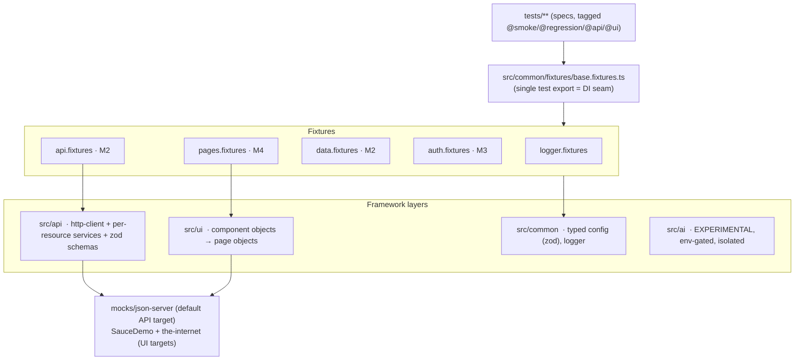

# Playwright Framework — Unified UI + API Test Automation

Production-grade test automation framework built on **Playwright + TypeScript (strict)**. One repo,
one toolchain, for both **UI** and **API** testing.

> Status: under active construction. See [the build plan](#build-status) for what is wired up so far.

<!-- badges: filled in during M7 -->
<!--     -->

---

## Why this exists

1. **Real project work** — a framework solid enough to run day-to-day regression and API suites.
2. **Learning** — a reference implementation of current Playwright practice (fixtures for DI, API/UI
   auth reuse, trace-first debugging, sharded CI).
3. **Portfolio** — demonstrates senior/lead QA engineering: layered architecture, documented
   trade-offs, CI/CD, and an isolated experimental AI-augmented layer.

## Quick start

```bash
nvm use 20                     # Node 20 LTS (or: brew install node@20)
npm ci
npx playwright install --with-deps
cp .env.example .env
npm run check:env              # validates config, prints resolved settings
npm test                       # full matrix
```

### Running subsets

| Command                                        | What runs                                   |
| ---------------------------------------------- | ------------------------------------------- |
| `npm run test:api`                             | API project only — **no browser launched**  |
| `npm run test:ui`                              | UI specs on Chromium                        |
| `npm run test:e2e`                             | Cross-layer (API seed → UI assert)          |
| `npm run test:a11y`                            | `@axe-core/playwright` scans                |
| `npm run test:visual`                          | Screenshot comparison                       |
| `npm run test:smoke` / `test:regression`       | Tag-filtered (`--grep`)                     |
| `npm run mock:start`                           | Long-running local json-server mock backend |
| `npm run report:allure && npm run report:open` | Build + open the Allure report              |

Add `--project=firefox|webkit|mobile-chrome|mobile-safari` to target a specific browser/viewport.

## Architecture



Full rationale — POM vs. Screenplay, why Playwright's `request` context instead of a REST-assured-style
library, retry philosophy, the AI isolation boundary — lives in [ARCHITECTURE.md](./ARCHITECTURE.md).

## Folder structure

```
src/common/   typed config (zod, fail-fast), fixtures (DI), logger, shared utils
src/api/      http-client → per-resource services → zod response schemas → DTO types
src/ui/       reusable component objects composed into page objects
src/ai/       experimental AI-augmented tooling (OFF unless AI_FEATURES_ENABLED=true)
data/         static reference data, faker factories, data-driven JSON/CSV
mocks/        local json-server mock backend (seeded, in-memory, offline)
tests/        specs only — ui / api / e2e / a11y / visual / contract
scripts/      global setup/teardown, env preflight
```

## Configuration

All config flows through `src/common/config/config.ts`: `.env` → **zod validation (fail fast)** →
per-environment URL resolution (`TEST_ENV=dev|staging|prod`). Nothing else reads `process.env`.
Secrets are never committed — `.env` is git-ignored; CI injects real values as secrets.

## Build status

| Milestone | Scope                                                                                                      | State |
| --------- | ---------------------------------------------------------------------------------------------------------- | ----- |
| M0        | Repo bootstrap, lint/format/hooks, TS strict                                                               | ✅    |
| M1        | Config, fixtures, logging, `playwright.config` (incl. browser-less `api` project)                          | ✅    |
| M2        | API service layer + zod schema validation + per-worker mock + seed/teardown + data-driven                  | ✅    |
| M3        | Auth reuse — UI `setup` project + storageState; per-worker API token (`apiAuth`)                           | ✅    |
| M4        | UI component + page objects (POM), SauceDemo e2e, iframe/shadow-DOM/upload/download/multi-window           | ✅    |
| M5        | Accessibility (axe-core + allowlist) + visual regression (committed baselines)                             | ✅    |
| M6        | Allure 3 (Java-free) + custom slowest/flaky reporter + tag taxonomy ([docs/TESTING.md](./docs/TESTING.md)) | ✅    |
| M7        | GitHub Actions (sharding) + Docker + secondary CI                                                          | ⏳    |
| M8        | Experimental AI-augmented layer                                                                            | ⏳    |
| M9        | Docs & portfolio polish                                                                                    | ⏳    |

## License

MIT — see [LICENSE](./LICENSE).
