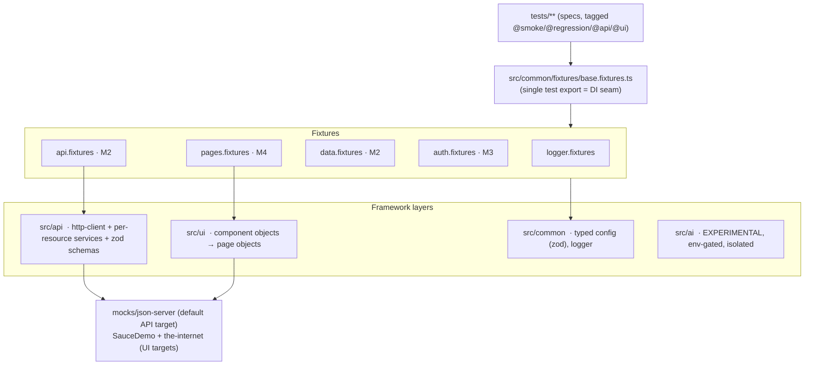

# Playwright Framework — Unified UI + API Test Automation

Production-grade test automation framework built on **Playwright + TypeScript (strict)**. One repo,
one toolchain, for both **UI** and **API** testing.

> Status: under active construction. See [the build plan](#build-status) for what is wired up so far.

<!-- Update OWNER/REPO once the GitHub remote exists. -->

[](https://github.com/OWNER/REPO/actions/workflows/ci.yml)
[](https://OWNER.github.io/REPO/)
[](./LICENSE)


---

## Why this exists

1. **Real project work** — a framework solid enough to run day-to-day regression and API suites.
2. **Learning** — a reference implementation of current Playwright practice (fixtures for DI, API/UI
   auth reuse, trace-first debugging, sharded CI).
3. **Portfolio** — demonstrates senior/lead QA engineering: layered architecture, documented
   trade-offs, CI/CD, and an isolated experimental AI-augmented layer.

## Quick start

```bash
nvm use 20                     # Node 20 LTS (or: brew install node@20)
npm ci
npx playwright install --with-deps
cp .env.example .env
npm run check:env              # validates config, prints resolved settings
npm test                       # full matrix
```

### Running subsets

| Command                                        | What runs                                   |
| ---------------------------------------------- | ------------------------------------------- |
| `npm run test:api`                             | API project only — **no browser launched**  |
| `npm run test:ui`                              | UI specs on Chromium                        |
| `npm run test:e2e`                             | Cross-layer (API seed → UI assert)          |
| `npm run test:a11y`                            | `@axe-core/playwright` scans                |
| `npm run test:visual`                          | Screenshot comparison                       |
| `npm run test:smoke` / `test:regression`       | Tag-filtered (`--grep`)                     |
| `npm run mock:start`                           | Long-running local json-server mock backend |
| `npm run report:allure && npm run report:open` | Build + open the Allure report              |

Add `--project=firefox|webkit|mobile-chrome|mobile-safari` to target a specific browser/viewport.

## Architecture



Full rationale — POM vs. Screenplay, why Playwright's `request` context instead of a REST-assured-style
library, retry philosophy, the AI isolation boundary — lives in [ARCHITECTURE.md](./ARCHITECTURE.md).

## Folder structure

```
src/common/   typed config (zod, fail-fast), fixtures (DI), logger, shared utils
src/api/      http-client → per-resource services → zod response schemas → DTO types
src/ui/       reusable component objects composed into page objects
src/ai/       experimental AI-augmented tooling (OFF unless AI_FEATURES_ENABLED=true)
data/         static reference data, faker factories, data-driven JSON/CSV
mocks/        local json-server mock backend (seeded, in-memory, offline)
tests/        specs only — ui / api / e2e / a11y / visual / contract
scripts/      global setup/teardown, env preflight
```

## Configuration

All config flows through `src/common/config/config.ts`: `.env` → **zod validation (fail fast)** →
per-environment URL resolution (`TEST_ENV=dev|staging|prod`). Nothing else reads `process.env`.
Secrets are never committed — `.env` is git-ignored; CI injects real values as secrets.

## CI/CD

| File                                   | Purpose                                                                                                                                                                                                                                              |
| -------------------------------------- | ---------------------------------------------------------------------------------------------------------------------------------------------------------------------------------------------------------------------------------------------------- |
| `.github/workflows/ci.yml`             | Lint/typecheck → sharded matrix (`chromium`/`firefox`/`webkit` × 2 shards) + browser-less `api` job. Caches npm + Playwright browsers; uploads blob reports, Allure results, and traces/videos on failure; merges blob reports into one HTML report. |
| `.github/workflows/allure-publish.yml` | On `CI` completing on `main`: builds the Allure report (trend history via `actions/cache`) and deploys it to **GitHub Pages**.                                                                                                                       |
| `.github/workflows/notify.yml`         | Reusable — posts to Slack/Teams on `main` failure (no-op without the webhook secret).                                                                                                                                                                |
| `docker/Dockerfile`                    | Official Playwright image (`v1.63.0-noble`) for reproducible local/CI runs: `docker build -f docker/Dockerfile -t pwf . && docker run --rm pwf npm run test:api`.                                                                                    |
| `.gitlab-ci.yml`, `ci/Jenkinsfile`     | Reference ports of the same pipeline for cross-platform CI.                                                                                                                                                                                          |

**Repo setup after cloning:** add the GitHub remote, enable Pages (Settings → Pages → _GitHub Actions_),
and optionally add `SLACK_WEBHOOK_URL` / `TEAMS_WEBHOOK_URL` secrets. Replace `OWNER/REPO` in the badges.

## AI-augmented layer (experimental, off by default)

`src/ai/` is an **isolated, env-gated** experiment — nothing in the core framework imports it, and the
default suite has zero AI dependency. Enable with `AI_FEATURES_ENABLED=true` + `ANTHROPIC_API_KEY`.

| Tool                              | Command / entry                                              | Guardrail                                                                                    |
| --------------------------------- | ------------------------------------------------------------ | -------------------------------------------------------------------------------------------- |
| Schema-bound test-data generation | `generateData(zodSchema, { description })`                   | Output is parsed through the zod schema; disabled → points you at `data/factories/`          |
| Locator self-heal                 | `suggestLocators(page, brokenSelector, intent)`              | **Suggest-only** — logs + attaches to the report, never rewrites a locator, never runs in CI |
| Story → draft spec                | `npm run ai:scaffold -- --story data/static/sample-story.md` | Writes a `.draft.spec.ts` with a TODO banner; a human finishes and commits it                |

See [src/ai/README.md](./src/ai/README.md) for the full risk boundary.

### How this maps to AI-augmented test engineering leadership

The interesting part for an EM / Head of QA isn't the API calls — it's the **operating model**:

- **Determinism stays sacred.** AI lives behind a flag, outside the hot path, so the regression suite
  a team relies on is byte-identical with or without it. That's the difference between "we use AI" and
  "our suite got flaky."
- **Schemas and page objects are the contract the AI works against.** A generator that must satisfy a
  zod schema, a scaffolder that must use existing fixtures — the framework's structure is what makes
  AI output _reviewable_ instead of a liability.
- **Human-in-the-loop by construction.** Suggest-only healing and draft-only scaffolding keep a person
  accountable for what lands in `main`. AI compresses the boring 80%; it doesn't sign off.
- **The leadership pitch:** invest in the deterministic core first (typed config, DI, contracts,
  trace-first debugging); layer AI on as an accelerant with hard boundaries; measure it on
  cycle-time, not novelty.

## Build status

| Milestone | Scope                                                                                                        | State |
| --------- | ------------------------------------------------------------------------------------------------------------ | ----- |
| M0        | Repo bootstrap, lint/format/hooks, TS strict                                                                 | ✅    |
| M1        | Config, fixtures, logging, `playwright.config` (incl. browser-less `api` project)                            | ✅    |
| M2        | API service layer + zod schema validation + per-worker mock + seed/teardown + data-driven                    | ✅    |
| M3        | Auth reuse — UI `setup` project + storageState; per-worker API token (`apiAuth`)                             | ✅    |
| M4        | UI component + page objects (POM), SauceDemo e2e, iframe/shadow-DOM/upload/download/multi-window             | ✅    |
| M5        | Accessibility (axe-core + allowlist) + visual regression (committed baselines)                               | ✅    |
| M6        | Allure 3 (Java-free) + custom slowest/flaky reporter + tag taxonomy ([docs/TESTING.md](./docs/TESTING.md))   | ✅    |
| M7        | GitHub Actions (sharded matrix + merged report + Allure→Pages + notify) · Docker · GitLab/Jenkins refs       | ✅    |
| M8        | Experimental AI layer — schema-bound data gen, suggest-only locator heal, story→draft scaffolder (env-gated) | ✅    |
| M9        | Docs & portfolio polish                                                                                      | ⏳    |

## License

MIT — see [LICENSE](./LICENSE).
